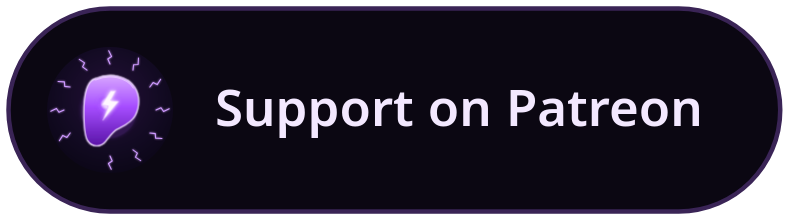

<p align="center">
  
</p>

<h1 align="center">agy-sandbox</h1>

<p align="center">
  <a href="https://github.com/phrenolt/agy-sandbox/actions/workflows/ci.yml"></a>
  <a href="https://github.com/phrenolt/agy-sandbox/actions/workflows/build.yml"></a>
</p>

<p align="center">
  <a href="https://www.patreon.com/phrenolt"></a>
</p>

Runs the Google Antigravity CLI (`agy`) inside a rootless Podman container. The
installer adds a managed launcher block to your shell rc file; runtime state is
kept under `~/.config/agy-sandbox` and `~/.local/share/agy-sandbox` instead of
letting the CLI use your normal home directory.

```bash
agy-sandbox              # launch interactive session (preserves file permissions via --userns=keep-id)
agy-sandbox --strict     # launch strict session (files owned by subUID, maximum isolation)
agy-sandbox . -c         # continue the most recent conversation in this project
agy-sandbox-sh           # drop into a bash shell inside the container
agy-sandbox-prompt "write a hello world in Go"   # non-interactive
agy-sandbox-prompt --im "Write a python script to calculate the fibonacci sequence" # allows selecting the model for the prompt interactively
agy-sandbox-prompt --model "Gemini 3.1 Pro (High)" --prompt "Tell what model you are" # note the model is case sensitive! use models below or --im above to call correct model.
agy-sandbox-prompt models    # list available models
agy-sandbox-prompt --help    # show AGY help
```

## Why containerise it

`agy` is an Electron app (full Chromium runtime) that:

- writes Mesa shader caches, fontconfig, gvfs metadata, and Firefox profile files across your `$HOME` on every run
- requests `cloud-platform` OAuth scope (full Google Cloud access)
- self-updates silently on every invocation

Containerised, those writes stay in the sandbox home at
`~/.local/share/agy-sandbox`. Interactive sessions expose only the selected
project, that persistent sandbox home, and its dedicated scratch directory.
Default sessions use `--userns=keep-id`, so those files remain owned by your
host user; strict sessions use an isolated subUID.

## Setup

> **Cloning:** this repo vendors its shared shell logic from
> [`agents-sandbox-common`](https://github.com/phrenolt/agents-sandbox-common)
> as a git submodule at `common/`. Clone with submodules so it comes along:
>
> ```bash
> git clone --recurse-submodules https://github.com/phrenolt/agy-sandbox.git
> # already cloned without it? pull the submodule in:
> git submodule update --init
> ```

```bash
# 1. build the image (prompts for optional Flutter and other development tools)
./build.sh

# Want the base image without any optional development packages or prompts?
./build.sh --raw

# 2. install the shell function
./install.sh
source ~/.bashrc

# 3. run
agy-sandbox
```

After pulling repository updates, rerun `./install.sh` and source your shell rc
file again. The generated launcher block must match the checked-out `common/`
launcher API; old generated blocks are not retained as compatibility code.

`./install.sh --print` shows the shell block without installing.
`./install.sh --uninstall` removes it (backup saved).

## Workspace Permissions & Isolation

An interactive session mounts:

- the selected project at `/work`;
- `~/.local/share/agy-sandbox` as the container home `/home/agy`;
- `~/.local/share/agy-sandbox/scratch` at `/scratch`, also exposed as
  `AGY_SCRATCH`.

By default, `agy-sandbox` uses `--userns=keep-id`. Container UID 1000 maps to
your host UID, so project and sandbox-home files remain editable from the host.

If you want maximum security and lockdown for a session, pass the `--strict` flag:

```bash
agy-sandbox --strict .
```
This uses `podman unshare chown` to assign the project, sandbox home, and scratch
directory to an isolated host subUID. Project ownership is restored when the
container exits; persistent sandbox-home data remains subUID-owned.

## Local Development Database (PostgreSQL)

During `./build.sh`, you can opt to install PostgreSQL 18. If installed, the container automatically initializes and starts a background `postgres` server every time you boot `agy-sandbox`.

- **Persistent**: The database data is stored in `~/.local/share/agy-sandbox/pgdata` on your host. Your data and schemas survive container restarts and rebuilds.
- **Ready to Go**: A default `agy` user and `agy` database are automatically created.

## Updating agy

The version is pinned at image build time. To check if an update is available without downloading:

```bash
agy-sandbox-check-update
```

To update:

```bash
agy-sandbox-update   # pulls latest manifest, re-verifies checksum, rebuilds, repins
```

Before an interactive launch, a throttled check (at most once every 24 hours)
may report a newer version and ask whether to rebuild. The check records its
timestamp under `~/.config/agy-sandbox`; it never rebuilds without confirmation.

## Image Details

Built from **`debian:trixie-slim`** (Debian 13). The base image includes curl,
Git, Python 3, build tools, Bubblewrap, and the minimal Chromium libraries needed
by the headless CLI. The AGY binary is downloaded from Google's manifest URL,
validated against its SHA512 checksum, and invoked only with `--version` during
the build. The `agy install` command is intentionally skipped because host shell
configuration is managed by this repository's installer.

## Internal Security & Bubblewrap

Authentication and agent configuration live in `.gemini` inside the persistent
sandbox home; the host's normal `~/.gemini` is not mounted. The project and
scratch directories described above are also mounted. Python and every optional
development runtime installed by the build matrix (Pip, Flutter/Dart,
Node/NPM/PNPM, Java, Gradle, Go, and Cargo) are wrapped with `bwrap`.

When one of those wrapped tools runs, it enters a nested mount namespace where
`/home/agy/.gemini` is replaced with an empty in-memory filesystem. Descendant
processes inherit that namespace and cannot read the persisted Gemini
credentials.

You can optionally inject development environments via the `./build.sh` prompts:

- **Rust:** Cargo (via rustup)
- **Node.js:** Debian's Node.js and NPM packages, plus optional PNPM 9
- **Java:** OpenJDK and Gradle
- **Go:** Golang
- **Python:** Pip and Virtual Environments (`python3-venv`)
- **Flutter:** Latest stable Flutter and Dart SDKs for analysis, formatting,
  package management, code generation, and headless tests. Android Studio, the
  Android SDK, emulators, Chrome, and desktop build toolchains are not installed;
  `flutter doctor` reports those targets as unavailable by design. Project
  dependencies still require network access when they are not already cached;
  invoking an omitted platform may also make Flutter fetch its artifacts.
- **Database:** PostgreSQL 18
